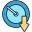
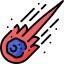
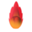
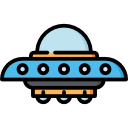

# Earth Defender

Earth Defender is a simple video game written in C++ using SFML library.
The goal of the game is to defend the Earth from falling meteors.
The player must click on meteors to destroy them before they hit the Earth. 


## Table of Contents
  - [Description](#description)
  - [Installation](#installation)
  
## Description
**Earth Defender** is a game where the objective is to protect Earth from falling meteors. Players must quickly react and click on meteors to destroy them before they crash into Earth. The game features point scoring, power-ups, and other mechanics to enhance gameplay.

This game includes several power-ups that give the player special abilities. Below is a table summarizing the available power-ups:

| Icon | Power-up Name      | Description                                                        |
|------|--------------------|--------------------------------------------------------------------|
|  | **Double Damage** | Doubles the player's damage for a limited time.                    |
|   | **Double Score**  | Doubles the points gained for each meteor destroyed.               |
|               | **Shield**        | Provides a protective shield that prevents one meteor hit.         |
|     | **Slow Meteor**   | Slows down the meteors for a limited time.                         |

# Meteor Types

Below is a table listing different types of meteors in the game. Each meteor has different speed, health, and damage attributes:

| Icon                | Meteor Type       | Speed     | Health    | Damage    | Score                                    |
|---------------------|-------------------|-----------|-----------|-----------|------------------------------------------------|
|   | **Small Meteor**   | 70px/s   | 1         | 1        | 1     |
|   | **Medium Meteor**  | 100px/s    | 2         | 2        | 2 |
|   | **Large Meteor**   | 150px/s    | 3         | 3        | 3 |


# Boss Fight Mechanics

When the boss spawns, meteors become more dangerous! As long as the boss is alive, meteors will increase in both speed and damage dealt. 

| Icon               | Boss Name          | Description                                                                 |
|--------------------|--------------------|-----------------------------------------------------------------------------|
|  | **Mighty Meteor Boss** | When the boss spawns, meteors will have increased speed and deal more damage until the boss is defeated. |

# Installation

### Prerequisites
Before you can build the project, you need to have the following software installed:

### Required:
- **C++ Compiler**
  - GCC (Linux/macOS)
  - MSVC (Windows)
- **CMake** (for building the project)
  
You can download and install the required software as follows:

- **CMake**: [Download here](https://cmake.org/download/)

#### 1. Clone the repository
 ```bash
https://github.com/PatryKozlowski/EarthDefender.git
cd EarthDefender
```

#### 2. Create the build directory
```bash
mkdir build
```

#### 3. Run cmake
```bash
#release:
cmake -DCMAKE_BUILD_TYPE=Release .. 

#Debug:
cmake -DCMAKE_BUILD_TYPE=Debug ..
```

#### 4. Build application
```bash
cd build

#release
cmake --build . --config Release

#debug
cmake --build . --config Debug
```

## Credits

All assets used in this project, including icons and graphics, are sourced from [FlatIcon](https://www.flaticon.com/). We are grateful to the talented artists and designers whose work has made this project possible.

